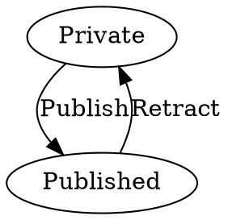
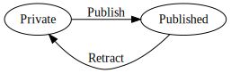
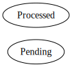
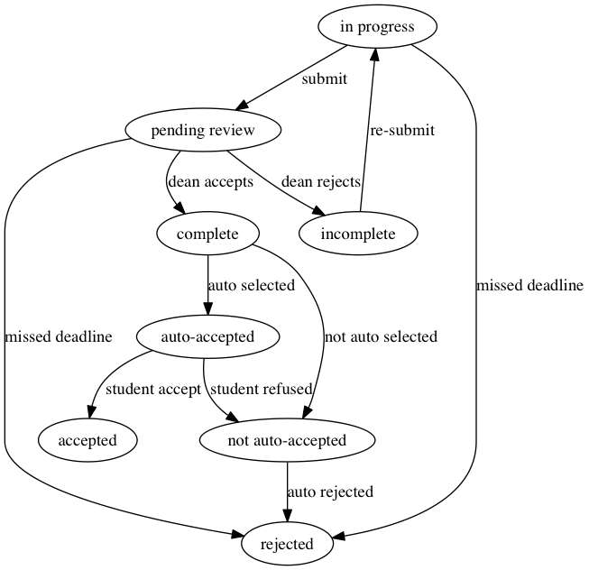
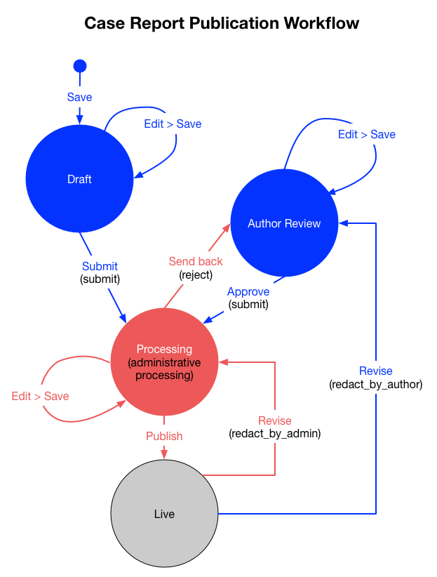
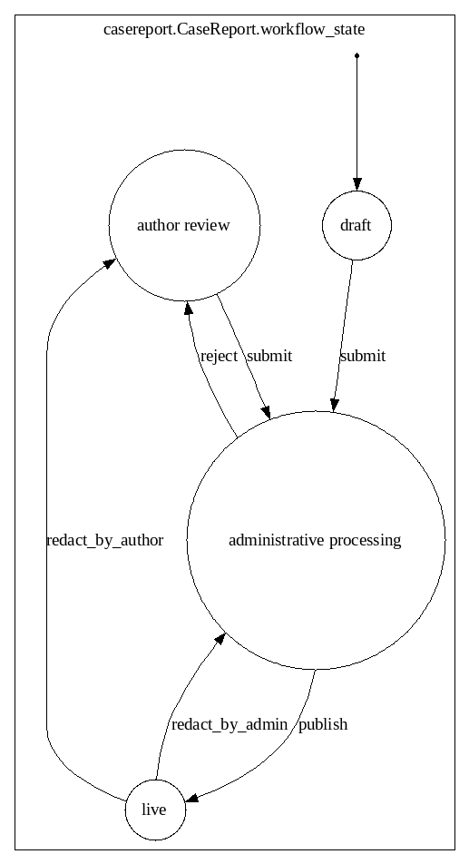

--
title: Workflow Management Using FSM in Django
author: Calvin Hendryx-Parker, CTO, Six Feet Up
date: IndyPy Python Web Conf 2019
---

# Who is this guy?

::: notes
* Six Feet Up
* IndyPy
* IndyAWS

Python, Plone Django
Wrote the Plone Training Section on Workflows
:::

# So What are Workflows?

::: notes
* Series of interactions to complete a task
* All over the place
* formal and informal
* Business Rules

These are specifically a subset of "State"
:::

# Finite State Machine

> A finite-state machine (FSM) or finite-state automaton (plural: automata), or simply a state machine, is a behavioral model used to design computer programs.

From [Wikipedia](https://en.wikipedia.org/wiki/Finite-state_machine)

---

> It is composed of a finite number of states associated to transitions.

---

> A transition is a set of actions that starts from one state and ends in another (or the same) state.


# A Simple Example





::: notes
Talk about Plone's workflows and the fact that DCWorkflow was so simple, yet powerful

What's not shown is who is allowed to do what

Permissions
:::

# Truly a Boolean?

## Not when it comes to state...



::: notes
Has a row been processed by some external process

Tempting to make this a boolean field on your object like a simple flag

Pattern, select all the things that haven't been processed and process them, but there is an in between state. Something else also started processing...
:::

# Extended to collaboration

::: notes
 - Users want to share information with only specific users

Talk about Plone's workflows and the relationship to permissions

:::

# OK, Real Life Please

## Ever been a student at a university?

---

{.stretch}

::: notes
 - Students submit a request for program change for review
:::

# What about researching cancer?

---

{ .stretch }

::: notes
 - Physicians submit a case study for review
:::

# Some workflows are automatic

>  A transition is started by a trigger, and a trigger can be an event or a condition.

::: notes
Virus checking
Batch Processing
State signals can trigger transitions that aren't fired by a human
:::

# So, Django....

### The Web framework for perfectionists with deadlines

::: notes
Opinionated, but not very in the area of permissions and roles
Permissions, and logging are often informal and scattered.

Typical Django dev flow is to build your models, expose the admin, then build some views.

At some point, you want restrictions, users want to see the object’s history, certain changes need to be ordered, etc.
Without a framework, this code can get spread across models, views, management commands, forms, middleware, etc.

You end up building custom queries and spreading them everywhere
:::

# Who

### Can do what

## When

::: notes
When is the tricky bit here

Bonus later!  (logging the actions)
:::

# Make some **Fat** Models

::: notes
Django encourages making fat models and thin views, this technique with the following Django add-on builds on this idea
:::

# Enter `django-fsm`

::: notes
reusable framework that gets everyone mentally aligned
:::

# Get started

<https://github.com/viewflow/django-fsm>

# Simple Approach 
## Complicated Problem


# Basics

* Custom Model Field -- `FSMField`
* Python Decorator -- `@transition`
* Model Methods via `contribute_to_class()`

::: notes
fun usage of contribute_to_class here, but basically when you decorate methods on your model's class with transition, this adds methods to your model to gather all transitions for a specific workflow
:::

# FSMField

~~~ {.stretch .python}
class CaseReport(CRDBBase, SharedObjectMixin):
    title = models.CharField(max_length=500,
                             null=True,
                             blank=True,
                             verbose_name='Case Title')
	...
    # Workflow control fields
    author_approved = models.BooleanField(default=False, blank=True)
    admin_approved = models.BooleanField(default=False, blank=True)
    workflow_state = FSMField(max_length=50,
                              choices=WorkflowState.CHOICES,
                              default=WorkflowState.INITIAL_STATE,
                              help_text="Workflow state")

    ...
~~~

::: notes
FSMIntegerField is also available if you want to store enumerated states instead of the strings
:::

# States Definition

~~~ {.stretch .python}
class WorkflowState(object):
    DRAFT = 'draft'
    ADMIN_REVIEW = 'processing'
    AUTHOR_REVIEW = 'author review'
    LIVE = 'live'
    RETRACTED = 'retracted'
    ...
    CHOICES = (
        (DRAFT, DRAFT.title()),
        (ADMIN_REVIEW, ADMIN_REVIEW.title()),
        (AUTHOR_REVIEW, AUTHOR_REVIEW.title()),
        (LIVE, LIVE.title())
    )
    ...
    INITIAL_STATE = DRAFT
	...
~~~

# How do you get to these states?

```python
@transition(field=workflow_state,
            source=[WorkflowState.DRAFT],
            permission=can_edit,
            target=WorkflowState.DRAFT
            )
def edit(self, by=None):
    pass
```

::: notes
Transitions!

This is example allows you to control the actions show on the UI to users

with full support for allowing access to transitions based on 

Which field (workflow)
What source states
To which target states
Given which permissions and conditions
Optionally... Which state to choose if an exception is thrown via `on_error`
or add custom props to the transition for UI help such as a verbose description
:::

---

```{.stretch .python}
@transition(field=workflow_state,
            source=[WorkflowState.AUTHOR_REVIEW, ],
            permission=can_submit,
            target=WorkflowState.ADMIN_REVIEW)
def approve(self, by=None):
    """ send to admins with approval """
    self.author_approved = True
    self.admin_approved = False
    try:
        emails.approved(self)
    except Exception as mail_err:
        print(mail_err)

    return "Thank you for approving your Case Report. We will contact you" \
           " when it goes live."
```

# Define Permissions

```{.stretch .python}
def can_edit(self, user=None):
    if not user:
        user = CurrentUserMiddleware.get_user()
    if self.workflow_state in (WorkflowState.DRAFT,
                               WorkflowState.RETRACTED,
                               WorkflowState.AUTHOR_REVIEW) and \
       user.email == self.primary_author.email:
        return True
    if self.workflow_state in (WorkflowState.ADMIN_REVIEW,) and \
       user.is_staff:
        return True
    return False
```

---

```{.stretch .python}
    def can_submit(self, user=None):
        # ensure author
        if not user:
            user = CurrentUserMiddleware.get_user()
        return user.email == self.primary_author.email
```

::: notes
an example of a permission callable

Conditions are a list of callables
:::

# Some Convenience

`get_all_FIELD_transitions`

:  Enumerates all declared transitions

`get_available_FIELD_transitions`

:  Returns all transitions data available in current state

`get_available_user_FIELD_transitions`

:  Enumerates all transitions data available in current state for provided user


::: notes
added via `contribute_to_class` to your model for you

easy to use now to grab transitions based on permission
:::

# Signals

* `django_fsm.signals.pre_transition`
* `django_fsm.signals.post_transition`

::: notes
are called before and after allowed transition. No signals on invalid transition are called.

sender The model class.

instance The actual instance being processed

name Transition name

source Source model state

target Target model state
:::

---

``` {.stretch .python}
def casereport_workflow_transitions(sender, **kwargs):
    # this is the hook that should handle all side effects of state
    # change transitions like sending emails, clearing queues, etc.
    cr = kwargs['instance']
    transition_name = kwargs['name']
    source_state = kwargs['source']
    end_state = kwargs['target']
    if end_state != source_state:
        print("handling %s transition for %s" % (transition_name, cr))
        print("...TODO...\n\n")


fsm_signals.post_transition.connect(
	casereport_workflow_transitions,
	sender=CaseReport
)
```

# Who Dunnit!

```{.stretch .python}
    def can_edit(self, user=None):
        if not user:
            user = CurrentUserMiddleware.get_user()
    ...
```

::: notes
Sometimes you do not know who the user is, like in a management command or cronjob

In our case, we created a middleware that uses a threadlocal to store the user if it wasn't in the request and tries multiple ways to find the user making the request.

Pre and post transition signals don’t include the ‘who’
But with some ‘clever’ middleware you can get it

And record a transition history (user, transition, object ) as (subject, verb, object, time)
Or define your own decorator like @transition to record user, transaction, object, args, kwargs, and timestamp -- see also django-fsm-log
:::

---

``` {.stretch .python}
    @transition(field=workflow_state,
                source=[WorkflowState.ADMIN_REVIEW, ],
                permission=can_reject,
                target=WorkflowState.AUTHOR_REVIEW,
                )
    def send_back(self, by=None):
        """ send the CR back to the author
        """
        self.admin_approved = False
        try:
            emails.send_back(self)
        except ConnectionRefusedError:
            pass
        user = CurrentUserMiddleware.get_user()
        author = User.objects.get(email__exact=self.primary_author.email)
        action.send(user, verb='sent back', action_object=self, target=author)
        return "The case report has been sent back to its author."
```

# Optimistic Locking

``` {.stretch .python}
from django_fsm import FSMField, ConcurrentTransitionMixin

class BlogPost(ConcurrentTransitionMixin, models.Model):
    state = FSMField(default='new')
```

::: notes
For guaranteed protection against race conditions caused by concurrently executed transitions, make sure:

 Your transitions do not have any side effects except for changes in the database,
 You always run the save() method on the object within django.db.transaction.atomic() block.
:::

# Want an audit log?

```python
@fsm_log_by
@transition(field=workflow_state,
            source=[WorkflowState.DRAFT],
            permission=can_edit,
            target=WorkflowState.DRAFT
            )
def edit(self, by=None):
    pass
```

<https://github.com/gizmag/django-fsm-log>

::: notes
Transition logging support
:::

# Add FSM to the Django Admin!

<https://github.com/gadventures/django-fsm-admin>

::: notes
You can enforce that the FSMField value can only be manipulated via a transition
:::

# Keep from making a mess...
## Take an FSM first strategy

Add this to your config for `django-fsm-admin`
```python
FSM_ADMIN_FORCE_PERMIT = True
```

::: notes
Be very careful with the Django Admin, you can make a real mess!

Make sure to build in FSM while building your models and before you build your views. FSM will be an integral part of your application and all interactions with the model need to use the FSM API.

Adding `FSM_ADMIN_FORCE_PERMIT = True` to your configuration settings, the above restriction becomes the default. Then one must explicitly allow that a transition method shows up in the admin interface.
:::


# Django Management Command!

~~~ {.stretch .console}
$ ./manage.py graph_transitions casereport.CaseReport  > t.dot
$ dot -O -Tpng t.dot; open t.dot.png
~~~

---

`ModuleNotFoundError: No module named 'graphviz'`

::: notes
don't forget to install the graphviz dep
:::

---

{.stretch}

# Questions?

## <calvin@sixfeetup.com>

[`@calvinhp`](https://twitter.com/calvinhp)
